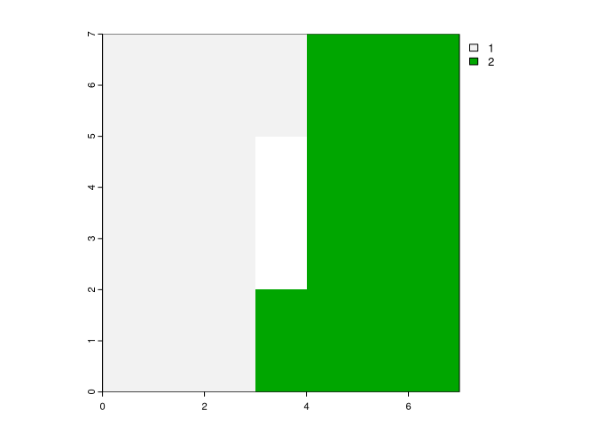
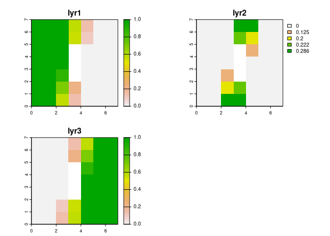

<!-- README.md is generated from README.Rmd. Please edit that file -->

# motifmw

<!-- badges: start -->

[](https://lifecycle.r-lib.org/articles/stages.html#experimental)
[](https://app.codecov.io/gh/Nowosad/motifmw?branch=main)
<!-- badges: end -->

The goal of **motifmw** is to describe spatial patterns of categorical
raster data for any defined moving window. Patterns are described
quantitatively using built-in signatures based on a co-occurrence
matrix.

## Installation

You can install the development version of the package with:

``` r
# install.packages("remotes")
remotes::install_github("Nowosad/motifmw")
```

## Example

``` r
library(motifmw)
library(terra)
#> terra 1.7.69
r = rast(matrix(c(rep(1, 23), rep(NA, 3), rep(2, 23)), ncol = 7))
plot(r)
```



``` r
w = matrix(1, 3, 3)
result = lsp_signature_mw(x = r, window = w)
result
#> class       : SpatRaster 
#> dimensions  : 7, 7, 3  (nrow, ncol, nlyr)
#> resolution  : 1, 1  (x, y)
#> extent      : 0, 7, 0, 7  (xmin, xmax, ymin, ymax)
#> coord. ref. :  
#> source(s)   : memory
#> names       : lyr1,      lyr2, lyr3 
#> min values  :    0, 0.0000000,    0 
#> max values  :    1, 0.2857143,    1
plot(result)
```



## Extended example

An extended example shows [how to compare spatial patterns using moving
window
approach](https://jakubnowosad.com/motifmw/articles/Introduction.html).
