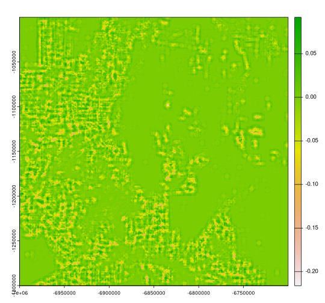
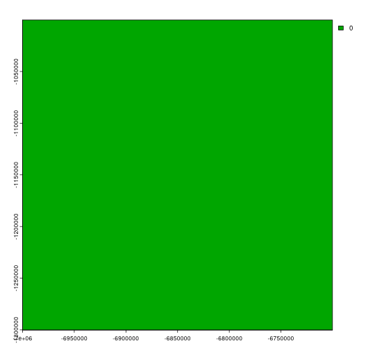

```r
# remotes::install_github("nowosad/motifmw")
# remotes::install_github("nowosad/spquery")
library(motifmw)
library(spquery)
library(terra)
```


```r
lc92 = rast("https://osf.io/download/tjzwe/")
lc18 = rast("https://osf.io/download/wdzy6/")
```


```r
coltb = read.csv("https://osf.io/download/2qd5k/")
coltb = coltb[c("value", "color")]
coltab(lc92) = coltb
coltab(lc18) = coltb
```


```r
plot(c(lc92, lc18))
```


```r
lc92 = crop(lc92, ext(-7e6, -67e5, -13e5, -1e6))
lc18 = crop(lc18, ext(-7e6, -67e5, -13e5, -1e6))
```


```r
plot(c(lc92, lc18))
```


## Square window


```r
window_size = 51
window = matrix(1, nrow = window_size, ncol = window_size)
plot(rast(window))
```


```r
system.time({
  lc92s = motifmw::lsp_signature_mw(x = lc92, window = window)
  lc18s = motifmw::lsp_signature_mw(x = lc18, window = window)
  lc_compare = spq_compare(lc92s, lc18s, dist_fun = "jensen-shannon")
})
#> 
|---------|---------|---------|---------|
=========================================
                                          

|---------|---------|---------|---------|
=========================================
                                          
#>    user  system elapsed 
#> 276.873  27.191 304.634
```


```r
plot(lc_compare)
```


## Circle window


```r
window2 = focalMat(rast(window), 25, type = "circle")
window2[window2 > 0] = 1
window2[window2 == 0] = NA
plot(rast(window2))
```




```r
system.time({
lc92s2 = lsp_signature_mw(x = lc92, window = window2)
lc18s2 = lsp_signature_mw(x = lc18, window = window2)
lc_compare2 = spq_compare(lc92s2, lc18s2, dist_fun = "jensen-shannon")
})
#> 
|---------|---------|---------|---------|
=========================================
                                          

|---------|---------|---------|---------|
=========================================
                                          
#>    user  system elapsed 
#> 256.107  33.083 289.627
```


```r
plot(c(lc_compare, lc_compare2))
```


```r
plot(c(lc_compare - lc_compare2))
```


## Comparison to the slower approach


```r
calculate_cove_focal = function(landscape_values, raster_window) {
  extract_cove = function(x, classes){
    comat::get_cove(comat::get_coma(x, classes = classes), ordered = FALSE, normalization = "pdf")
  }
  raster_window[!is.na(raster_window)] <- landscape_values[!is.na(raster_window)]
  result = extract_cove(x = raster_window, classes = 1:9)
  return(result)
}
system.time({
lc92sb = terra::focal(x = lc92, w = dim(window), silent = FALSE, fun = calculate_cove_focal, raster_window = window)
lc18sb = terra::focal(x = lc18, w = dim(window), silent = FALSE, fun = calculate_cove_focal, raster_window = window)
lc_compare1b = spq_compare(lc92sb, lc18sb, dist_fun = "jensen-shannon")
})
#> 
|---------|---------|---------|---------|
=========================================
                                          

|---------|---------|---------|---------|
=========================================
                                          
#>    user  system elapsed 
#> 531.132  51.240 583.975
```


```r
plot(c(lc_compare, lc_compare1b))
```


```r
plot(c(lc_compare - lc_compare1b))
```




```r
# c1d1 = resample(c1["dist"], lc_compare)
# c1d2 = resample(c1["dist"], lc_compare, method = "near")
```
